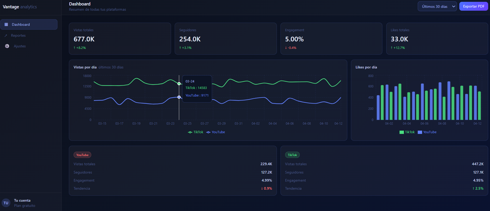
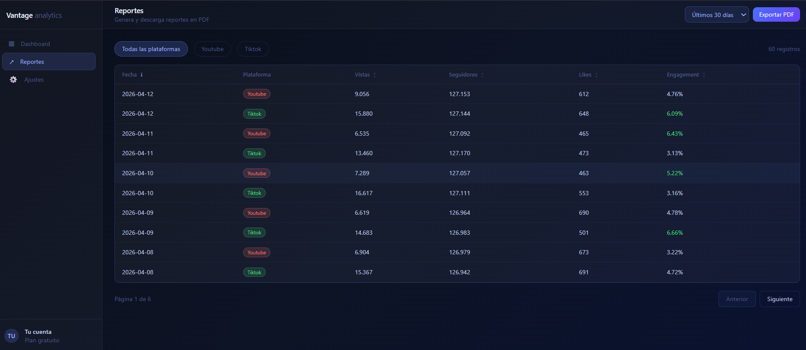
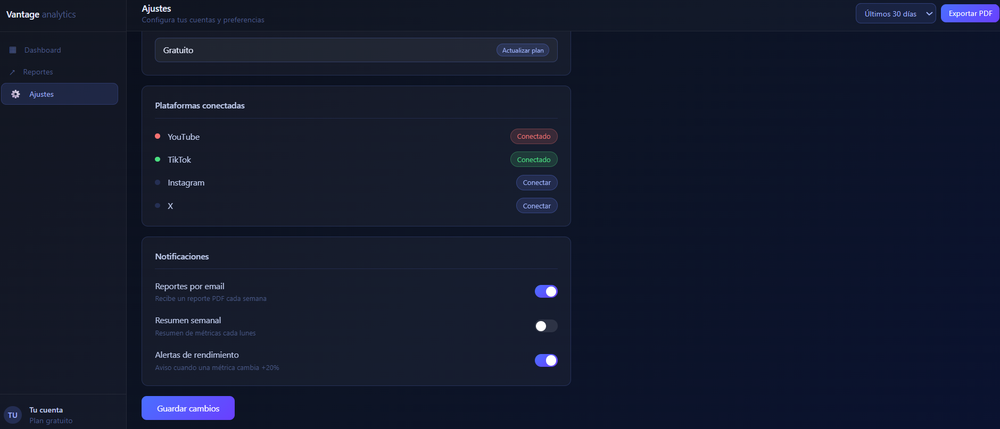

# Vantage Analytics

> Dashboard de analytics para creadores de contenido — unifica métricas de YouTube y TikTok en un solo lugar.


---

## Vista previa

)



---

## Features

- 📊 &nbsp;Dashboard unificado para YouTube y TikTok
- 📈 &nbsp;Gráfica de vistas por día con Recharts
- 🃏 &nbsp;Tarjetas de métricas con tendencia y engagement
- ⚡ &nbsp;Caché inteligente con React Query (5 min staleTime)
- 🔌 &nbsp;API client con switch mock/real vía variable de entorno
- 🏗️ &nbsp;Arquitectura feature-first escalable
- 🌙 &nbsp;Preparado para modo oscuro

---

## Stack técnico

| Categoría | Tecnología |
|-----------|-----------|
| Framework | React 19 + TypeScript |
| Build tool | Vite 8 |
| Estilos | Tailwind CSS 4 |
| Estado servidor | TanStack React Query |
| Estado cliente | Zustand |
| Gráficas | Recharts |
| Routing | React Router v7 |

---

## Estructura del proyecto

src/
├── features/
│   ├── analytics/
│   │   ├── components/    # MetricCard, etc.
│   │   └── hooks/         # useMetrics
│   ├── platforms/
│   ├── reports/
│   └── auth/
├── components/
│   ├── ui/                # componentes genéricos
│   ├── charts/            # wrappers de Recharts
│   └── layout/            # Sidebar, Header, AppLayout
├── lib/
│   ├── api-client.ts      # fetch con switch mock/real
│   └── mock-data.ts       # datos generados
├── store/                 # Zustand slices
├── hooks/                 # hooks globales
├── types/                 # tipos TypeScript
└── router/                # definición de rutas

---

## Correr el proyecto

```bash
# Instalar dependencias
pnpm install

# Servidor de desarrollo
pnpm dev

# Build de producción
pnpm build
```

### Variables de entorno

Crea un archivo `.env` en la raíz:

```env
# Usar datos mock (default: true)
# Cambiar a "false" cuando conectes APIs reales
VITE_USE_MOCK=true
```

---

## Roadmap

- [ ] Selector de rango de fechas
- [ ] Página de reportes con export PDF
- [ ] Integración real con YouTube Data API
- [ ] Integración real con TikTok API
- [ ] Modo oscuro
- [ ] Autenticación con Clerk
- [ ] Plan de agencia con múltiples cuentas

---

## Autor

Hecho con ❤️ por **Carolina Páez https://github.com/CarobethPaez **

git 